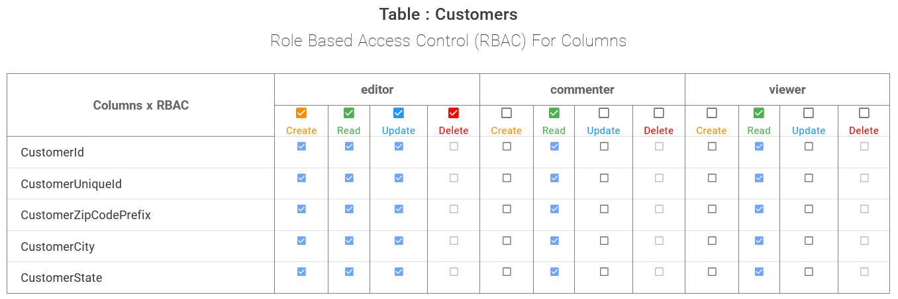
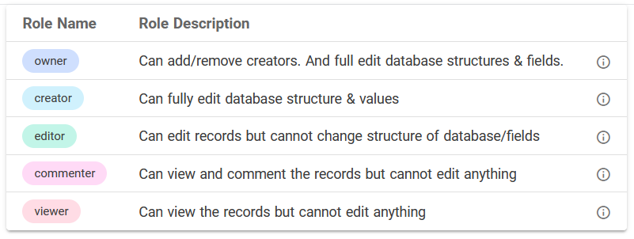

# NocoDB

Start setup:

    docker-compose up -d

Connect to database from NocoDB web UI using credentials in .env:

    Host Address: root_db
    Port Number: 5432
    Username: nocodb1
    Password: nocodb1
    Database: nocodb

For external applications, use `localhost:5433` (or `host-ip-address:port`, e.g. `192.168.1.2:5433` ) instead.

If trying to load data by executing SQL statements, the `NC_DB` variable does not provide
enough permissions for the user, and will result in a `Parser.parseErrorMessage`.
Instead, use the Postgres credentials in the `.env` file.

**Schemas:** Each Project in the NocoDB UI allows connection to one schema only (default `public` schema).
To change this, the connection JSON in `Edit Connection JSON` has to be modified to include
a `searchPath`. See [issue](https://github.com/nocodb/nocodb/issues/226) on GitHub and the
linked video.

**File uploads:** Currently, CSV files cannot be uploaded using NocoDB web UI, but this
[feature request](https://github.com/nocodb/nocodb/issues/179) is in one of their
[roadmaps](https://github.com/nocodb/nocodb/projects/1#card-67764613) for the future.

**Audit:** User operations and changes are recorded in the `Audit` tab. Logging?

**Triggers/Alerts:** Triggers can be set up using [webhooks](https://docs.nocodb.com/developer-resources/webhooks)
in the `Automations` tab when viewing a table. `INSERT`, `UPDATE`, and `DELETE` triggers are supported and when
such an event occurs, a notification can be sent to one of the applications (e.g. email, Slack, Teams, WhatsApp, HTTP API, etc.).

**Access Control:** CRUD operations are available at column-level and row-level granularity:

Currently, there are 5 system-defined roles, but customized roles will be available in the future.

There is also access control for tables, relations, and the NocoDB web UI.

**Sharing:** Table views can be shared via links (optionally password-protected).

**Backups:** Project metadata can be backedup by exporting a zip file, and imported when
required to recreate the project with the same specifications. However,
[data backup](https://github.com/nocodb/nocodb/issues/384) is not supported at the moment.
